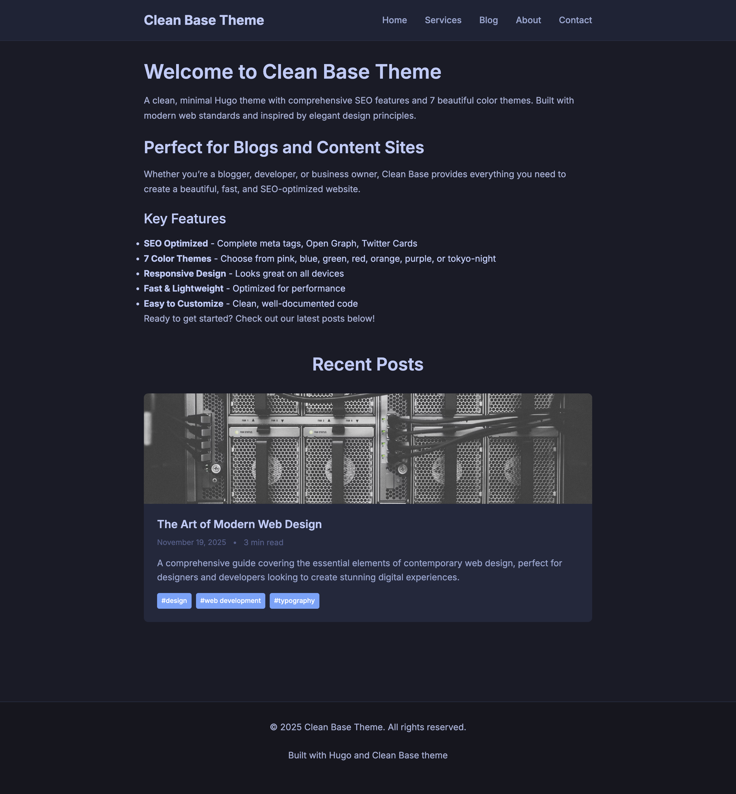

# Clean Base Hugo Theme

A minimal Hugo theme with comprehensive SEO features and 7 color themes. No JavaScript required.



## Features

- **SEO Optimized** - Meta tags, Open Graph, Twitter Cards, canonical URLs
- **Flexible Content** - Separate titles for display and SEO, custom summaries, slug control
- **7 Color Themes** - Pink, Blue, Green, Red, Orange, Purple, Tokyo Night (default)
- **Services Templates** - Ready-to-use templates for service businesses
- **No JavaScript** - Pure HTML + CSS using modern techniques
- **Responsive** - Works on all screen sizes
- **Permalink Control** - Use `/posts/` or root-level URLs
- **Tag Support** - Full taxonomy support
- **Featured Images** - Automatic Open Graph integration

## Installation

1. Clone this theme to your Hugo site's `themes/` directory:
   ```bash
   git clone https://github.com/inhmedia/clean-base.git themes/clean-base
   ```

2. Copy the example configuration:
   ```bash
   cp themes/clean-base/exampleSite/config.yaml config.yaml
   ```

3. Update your site's configuration:
   ```yaml
   theme: clean-base
   ```

## Configuration

### Basic Setup

```yaml
# config.yaml
baseURL: "https://yourdomain.com"
languageCode: "en-us"
title: "Your Site Title"
theme: "clean-base"

# URL Structure
permalinks:
  posts: "/posts/:slug/"  # or "/:slug/" for root level

params:
  # Color theme (tokyo-night is default)
  color_theme: "tokyo-night"  # pink, blue, green, red, orange, purple, tokyo-night

  # SEO Settings
  description: "Your site's default meta description"
  seo_summary_length: 160
  card_summary_length: 150
  default_og_image: "/images/og-default.jpg"

  # Content settings
  show_recent_posts: true
  recent_posts_count: 6
  show_related_posts: true

  # Footer
  footer_text: "Built with Hugo and Clean Base theme"
  logo: "/images/logo.png"  # Optional
```

### Post Front Matter

```yaml
---
title: "Page Heading"
seo_title: "SEO Optimized Title"  # Optional
date: 2025-11-19
draft: false
slug: "custom-url-slug"  # Optional
description: "Meta description for SEO"  # Optional
summary: "Summary for post cards"  # Optional
tags: ["hugo", "themes"]
author: "Your Name"
featured_image: "/images/post.jpg"
toc: true  # Show table of contents
---
```

### Color Themes

Available themes:

- **Pink** (`pink`) - Soft dusty pink
- **Blue** (`blue`) - Professional blue
- **Green** (`green`) - Natural green
- **Red** (`red`) - Bold red
- **Orange** (`orange`) - Vibrant orange
- **Purple** (`purple`) - Deep purple
- **Tokyo Night** (`tokyo-night`) - Dark theme with cool blue accent (default)

## SEO Features

### Title Management
- `title` - Page headings and fallback for SEO
- `seo_title` - Optional separate `<title>` tag for search engines
- Automatic fallback system

### Meta Descriptions
- `description` - Custom meta description
- Auto-generation from summary or content
- Configurable length via `seo_summary_length`

### URL Control
- `slug` - Custom URL slugs
- Flexible permalink structure
- Automatic canonical tags

### Social Media
- Open Graph for Facebook/LinkedIn
- Twitter Cards
- Structured data for search engines

## Services Templates

The theme includes templates for service businesses:

```
content/
└── services/
    ├── _index.md           # Services listing page
    ├── service-one.md
    └── service-two.md
```

Service frontmatter:
```yaml
---
title: "Service Name"
description: "Service description"
price_range: "Starting at $X"
featured_image: "/images/service.jpg"
features:
  - "Feature 1"
  - "Feature 2"
benefits:
  - text: "Benefit description"
    image: "/images/benefit.jpg"
cta_text: "Get Started"
cta_link: "/contact/"
---
```

## Content Structure

```
content/
├── _index.md          # Homepage
├── about.md           # About page
├── contact.md         # Contact page
├── posts/             # Blog posts
│   ├── _index.md
│   └── post-one.md
└── services/          # Services (optional)
    ├── _index.md
    └── service-one.md
```

## Customization

### Creating Custom Color Themes

Add to `static/css/style.css`:

```css
body.theme-custom {
    --accent-color: #hexcode;
    --accent-hover: #hexcode;
}
```

For dark themes, also define:
```css
body.theme-custom {
    --accent-color: #hexcode;
    --accent-hover: #hexcode;
    --text-primary: #hexcode;
    --text-secondary: #hexcode;
    --bg-primary: #hexcode;
    --bg-card: #hexcode;
    --bg-white: #hexcode;
    --border-light: #hexcode;
}
```

### Typography

Change fonts in `layouts/_default/baseof.html`:

```html
<link href="https://fonts.googleapis.com/css2?family=YourFont:wght@400;500;600;700&display=swap" rel="stylesheet">
```

Then update CSS:
```css
body {
    font-family: 'YourFont', sans-serif;
}
```

## License

MIT License. See [LICENSE](LICENSE) for details.

## Credits

- Built with [Hugo](https://gohugo.io/)
- Typography: [Inter](https://fonts.google.com/specimen/Inter)
